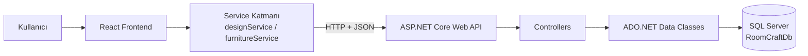
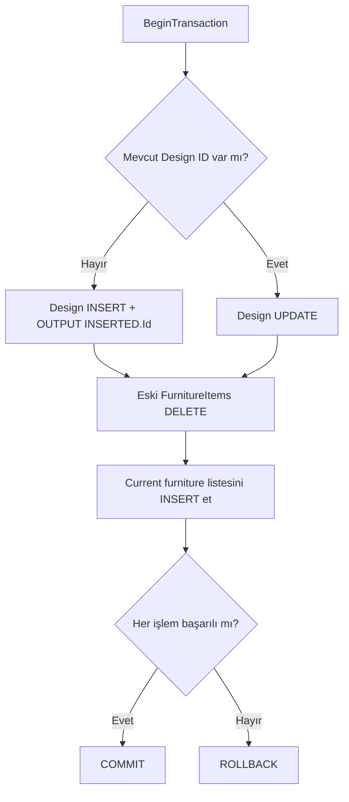

# RoomCraft – Interactive Room Planner

RoomCraft, kullanıcıların gerçek oda ölçülerine göre oda planı oluşturabildiği, mobilyaları kuş bakışı çalışma alanına ekleyip sürükleyebildiği, yeniden boyutlandırabildiği, döndürebildiği, katmanlarını yönetebildiği ve tasarım maliyetini bütçeyle birlikte takip edebildiği **full-stack bir oda yerleşim planlama uygulamasıdır**.
Proje yalnızca görsel bir arayüzden oluşmaz. React tabanlı frontend; ASP.NET Core Web API üzerinden SQL Server veritabanıyla haberleşir. Tasarımlar ve tasarıma bağlı mobilyalar veritabanında kalıcı olarak saklanır, daha sonra tekrar açılabilir, düzenlenebilir, kopyalanabilir, yeniden adlandırılabilir ve silinebilir.

> RoomCraft'ın ana planlama deneyimi 2D kuş bakışı oda görünümü üzerine kuruludur. Mobilya konumları santimetre cinsinden tutulur; arayüzde dinamik ölçekleme ile piksele dönüştürülür.

---

## İçindekiler

- [Projenin Amacı](#projenin-amacı)
- [Öne Çıkan Özellikler](#öne-çıkan-özellikler)
- [Uygulama Sayfaları](#uygulama-sayfaları)
- [Kullanılan Teknolojiler](#kullanılan-teknolojiler)
- [Genel Mimari](#genel-mimari)
- [Frontend Mimarisi](#frontend-mimarisi)
- [Planner Veri ve State Yapısı](#planner-veri-ve-state-yapısı)
- [Oda Oluşturma ve Ölçekleme](#oda-oluşturma-ve-ölçekleme)
- [Mobilya Kataloğu](#mobilya-kataloğu)
- [Sürükleme Sistemi](#sürükleme-sistemi)
- [Oda Sınırı Kontrolü](#oda-sınırı-kontrolü)
- [Izgaraya Yapışma](#ızgaraya-yapışma)
- [Boyutlandırma](#boyutlandırma)
- [Döndürme](#döndürme)
- [Çakışma Algoritması](#çakışma-algoritması)
- [Kapı ve Pencere Sistemi](#kapı-ve-pencere-sistemi)
- [Mobilya Özellikleri ve Katman Yönetimi](#mobilya-özellikleri-ve-katman-yönetimi)
- [Undo / Redo](#undo--redo)
- [Klavye Kontrolleri](#klavye-kontrolleri)
- [Zoom Sistemi](#zoom-sistemi)
- [Maliyet ve Bütçe Sistemi](#maliyet-ve-bütçe-sistemi)
- [Hazır Oda Şablonları](#hazır-oda-şablonları)
- [Kayıtlı Tasarımlar](#kayıtlı-tasarımlar)
- [Backend Mimarisi](#backend-mimarisi)
- [ADO.NET Veri Erişim Katmanı](#adonet-veri-erişim-katmanı)
- [Transaction ile Güvenli Kayıt](#transaction-ile-güvenli-kayıt)
- [REST API Endpointleri](#rest-api-endpointleri)
- [Veritabanı Tasarımı](#veritabanı-tasarımı)
- [Proje Klasör Yapısı](#proje-klasör-yapısı)
- [Kurulum](#kurulum)
- [Projeyi Çalıştırma](#projeyi-çalıştırma)
- [Uygulama Notları ve Geliştirilebilecek Alanlar](#uygulama-notları-ve-geliştirilebilecek-alanlar)

---

# Projenin Amacı

RoomCraft'ın amacı, kullanıcıların bir oda için mobilya satın almadan veya fiziksel yerleşim yapmadan önce farklı düzenleri görsel olarak deneyebilmesini sağlamaktır. Kullanıcı;

- oda türünü ve gerçek ölçülerini belirleyebilir,
- duvar ve zemin renklerini seçebilir,
- katalogdan mobilya ekleyebilir,
- mobilyaları oda içinde hareket ettirebilir,
- mobilyaların ölçülerini değiştirebilir,
- 90 derecelik adımlarla döndürebilir,
- çakışmaları görebilir,
- kapı ve pencereleri duvarlara yerleştirebilir,
- mobilyaları kilitleyebilir,
- katman sırasını değiştirebilir,
- toplam maliyeti ve bütçe durumunu takip edebilir,
- tasarımını SQL Server'a kaydedebilir,
- kayıtlı tasarımını daha sonra yeniden açıp düzenleyebilir.

Proje, frontend etkileşimleri ile backend/veritabanı işlemlerini aynı uygulamada birleştirerek uçtan uca bir full-stack geliştirme örneği sunar.

---

# Öne Çıkan Özellikler

## Oda planlama

- Gerçek oda genişliği ve uzunluğu ile çalışma alanı oluşturma
- 2–15 metre aralığında oda ölçüsü doğrulaması
- Oda adı ve oda türü belirleme
- Duvar ve zemin rengi seçimi
- Oda bilgilerini sonradan düzenleme
- Gerçek metre değerlerini ekranda dinamik piksel ölçeğine dönüştürme
- Oda ölçü çizgileri ve 10 cm tabanlı grid görünümü

## Mobilya etkileşimleri

- Katalogdan mobilya ekleme
- Pointer Events ile özel drag sistemi
- Dokunmatik cihazlarla uyumlu pointer tabanlı etkileşim
- Oda sınırından çıkmayı engelleme
- 10 cm grid'e hizalama
- Sağ alt resize handle ile yeniden boyutlandırma
- Minimum mobilya ölçülerini koruma
- 0°, 90°, 180° ve 270° döndürme
- Mobilya kopyalama
- Mobilya silme
- Mobilya kilitleme
- Z-index tabanlı katman yönetimi
- Çakışan mobilyaları tespit etme ve uyarı gösterme

## Kullanıcı deneyimi

- Seçili mobilya paneli
- Oda özellikleri paneli
- Bootstrap tabanlı modal ve bildirimler
- Undo / Redo
- Klavye kısayolları
- Zoom kontrolü
- Odayı toplu temizleme
- Responsive arayüz
- Boş durum ekranları

## Veri ve full-stack özellikleri

- ASP.NET Core Web API
- SQL Server veri kalıcılığı
- ADO.NET ile manuel SQL işlemleri
- Parametreli SQL sorguları
- Tasarım ve mobilya arasında foreign key ilişkisi
- Cascade delete
- Yeni tasarım oluşturma
- Mevcut tasarımı güncelleme
- Tasarım açma
- Tasarım kopyalama
- Tasarım adını değiştirme
- Tasarım silme
- Tasarım kartlarında mobilya sayısı
- SQL Transaction ile tasarım + mobilyaların atomik kaydı

---

# Uygulama Sayfaları

RoomCraft, React Router kullanmak yerine `App.jsx` içerisindeki `currentPage` state'i üzerinden sayfa değiştirir.

```text
App.jsx
│
├── home
├── planner
├── saved-designs
├── templates
└── about
```

## Ana Sayfa

Ana sayfa RoomCraft'ın tanıtım ekranıdır. Sayfa component bazlı bölümlere ayrılmıştır:

- Hero
- Özellik şeridi
- Hazır oda şablonları önizlemesi
- Nasıl çalışır bölümü
- Öne çıkan özellikler
- Örnek kayıtlı tasarımlar
- CTA alanı

Ana sayfadaki `savedDesigns.js` verisi tanıtım amaçlı statik demo içeriğidir. Gerçek veritabanı kayıtları **Tasarımlarım** sayfasında API üzerinden yüklenir.

## Tasarım Ekranı

Uygulamanın ana çalışma alanıdır. Masaüstü yerleşimi:

```text
┌─────────────────────────────────────────────────────────────┐
│                     Planner Toolbar                         │
├───────────────┬──────────────────────────┬──────────────────┤
│ Mobilya       │                          │ Seçili Mobilya   │
│ Kataloğu      │      Room Canvas         ├──────────────────┤
│               │                          │ Oda Özellikleri  │
├───────────────┴──────────────────────────┴──────────────────┤
│                    Maliyet Özeti                            │
├─────────────────────────────────────────────────────────────┤
│                    Bütçe Takibi                             │
└─────────────────────────────────────────────────────────────┘
```

## Tasarımlarım

SQL Server'da kayıtlı gerçek tasarımlar bu sayfada listelenir. Her kartta:

- tasarım adı,
- oda türü,
- oda ölçüsü,
- mobilya sayısı,
- bütçe,
- toplam maliyet,
- son güncelleme tarihi

gösterilir. Desteklenen işlemler:

- Aç
- Kopyala
- Ad Değiştir
- Sil

## Hazır Şablonlar

Önceden hazırlanmış oda planlarını listeler. Bir şablon seçildiğinde oda ölçüleri ve tanımlı mobilyalar Planner'a aktarılır.

## Hakkımızda

RoomCraft'ın amacı, temel yetenekleri ve çalışma akışını açıklayan ürün tanıtım sayfasıdır. Sayfanın CTA butonu yeni tasarım akışını başlatır.

---

# Kullanılan Teknolojiler

## Frontend

| Teknoloji             | Kullanım Amacı                                                       |
| --------------------- | -------------------------------------------------------------------- |
| React 19              | Component tabanlı kullanıcı arayüzü ve state yönetimi                |
| JavaScript ES Modules | Uygulama mantığı                                                     |
| Vite 8                | Development server ve production build                               |
| Bootstrap 5.3         | Modal, alert/toast ve responsive yardımcı sınıflar                   |
| CSS                   | Özel tasarım sistemi, grid, responsive görünüm ve component stilleri |
| Lucide React          | Arayüz ikonları                                                      |
| React Icons           | Ek ikon desteği                                                      |
| Fetch API             | Frontend → backend HTTP iletişimi                                    |

## Backend

| Teknoloji                | Kullanım Amacı                       |
| ------------------------ | ------------------------------------ |
| ASP.NET Core Web API     | REST API katmanı                     |
| .NET 10                  | Backend runtime ve framework         |
| C#                       | Backend iş ve veri erişim mantığı    |
| Microsoft.Data.SqlClient | SQL Server bağlantısı                |
| ADO.NET                  | Manuel SQL sorguları ve veri erişimi |
| OpenAPI                  | Development ortamında API şeması     |

## Veritabanı

| Teknoloji            | Kullanım Amacı                                      |
| -------------------- | --------------------------------------------------- |
| Microsoft SQL Server | Tasarım ve mobilya verilerini kalıcı olarak saklama |
| SQL Server Express   | Projedeki varsayılan local SQL Server instance'ı    |
| T-SQL                | Tablo, ilişki ve CRUD sorguları                     |

---

# Genel Mimari



Uygulama katmanları birbirinden ayrılmıştır:

1. **UI / Component katmanı** kullanıcı etkileşimini yönetir.
2. **Page katmanı** componentleri birleştirir ve ana state'i yönetir.
3. **Service katmanı** HTTP isteklerini merkezi hale getirir.
4. **Controller katmanı** REST endpointlerini sunar.
5. **Data katmanı** ADO.NET ile SQL Server'a erişir.
6. **Database katmanı** kalıcı veriyi saklar.

---

# Frontend Mimarisi

## `App.jsx`

Uygulamanın en üst seviye navigation state'ini yönetir. Temel state'ler:

```js
const [currentPage, setCurrentPage] = useState("home");
const [selectedTemplate, setSelectedTemplate] = useState(null);
const [selectedDesignId, setSelectedDesignId] = useState(null);
```

- `selectedDesignId` kayıtlı bir tasarım açıldığında Planner'a aktarılır.
- `selectedTemplate` ise hazır şablon seçildiğinde Planner'a aktarılır.

Yeni tasarım başlatıldığında iki değer de temizlenir:

```text
selectedDesignId = null
selectedTemplate = null
currentPage = planner
```

Bu sayede eski bir tasarımın state'i yeni tasarıma taşınmaz.

## `PlannerPage.jsx`

Planner ekranının merkezi yöneticisidir. Başlıca sorumlulukları:

- oda state'ini tutmak,
- mobilya listesini yönetmek,
- seçili mobilyayı belirlemek,
- maliyet hesaplamak,
- bütçe durumunu hesaplamak,
- mobilya eklemek/silmek/kopyalamak,
- döndürme ve katman işlemlerini yönetmek,
- undo/redo geçmişini tutmak,
- klavye kısayollarını yönetmek,
- kayıtlı tasarımı API'den yüklemek,
- şablonu Planner state'ine dönüştürmek,
- transaction tabanlı save endpointini çağırmak.

## Single Source of Truth

Odadaki mobilyaların ana kaynağı:

```js
const [furnitureItems, setFurnitureItems] = useState([]);
```

`FurnitureSidebar`, `RoomCanvas`, `PropertiesPanel` ve `CostSummary` kendi bağımsız mobilya listelerini tutmaz. Ana veri `PlannerPage` içindedir ve componentlere props ile aktarılır. Bu yaklaşım state senkronizasyon problemlerini azaltır.

---

# Planner Veri ve State Yapısı

Planner içinde kullanılan başlıca state'ler:

| State                   | Açıklama                                          |
| ----------------------- | ------------------------------------------------- |
| `room`                  | Tasarım adı, oda türü, ölçüler ve renkler         |
| `furnitureItems`        | Odaya eklenen bütün mobilyalar                    |
| `selectedFurnitureId`   | Seçili mobilyanın benzersiz UI ID'si              |
| `snapToGrid`            | 10 cm grid'e yapışmanın açık/kapalı durumu        |
| `budget`                | Kullanıcının belirlediği maksimum bütçe           |
| `isSaving`              | Save işlemi sırasında buton durumunu kontrol eder |
| `pastFurnitureStates`   | Undo geçmişi                                      |
| `futureFurnitureStates` | Redo geçmişi                                      |
| `zoomLevel`             | Görsel zoom yüzdesi                               |
| `activeDesignId`        | O an üzerinde çalışılan DB tasarım ID'si          |
| `notification`          | Kullanıcı bildirim bilgisi                        |

Derived data örnekleri:

```js
const selectedFurniture = furnitureItems.find(
  (item) => item.id === selectedFurnitureId,
);

const furnitureCount = furnitureItems.length;
const subtotal = calculateFurnitureSubtotal(furnitureItems);
```

Bu değerler ayrı state olarak tutulmak yerine mevcut state'lerden hesaplanır.

---

# Oda Oluşturma ve Ölçekleme

`RoomForm` kullanıcıdan şu bilgileri alır:

- Tasarım adı
- Oda türü
- Oda genişliği
- Oda uzunluğu
- Duvar rengi
- Zemin rengi

Oda ölçüleri form seviyesinde **2–15 metre** aralığında sınırlandırılmıştır.

## Gerçek ölçü → ekran ölçüsü

Temel ölçek:

```text
1 metre = 100 piksel
```

Örneğin 5 × 4 metre oda teorik olarak:

```text
500 × 400 px
```

olur. Ancak büyük odalarda çalışma alanının taşmaması için `RoomCanvas` dinamik ölçek hesaplar:

```js
const fitScale = Math.min(
  BASE_SCALE,
  MAX_ROOM_WIDTH / room.width,
  MAX_ROOM_HEIGHT / room.height,
);
```

Projede:

```text
BASE_SCALE = 100
MAX_ROOM_WIDTH = 650
MAX_ROOM_HEIGHT = 500
```

Zoom daha sonra bu ölçeğin üzerine uygulanır:

```js
const scale = fitScale * (zoomLevel / 100);
```

Mobilyalar ise santimetre cinsinden saklanır:

```js
const widthPx = (furniture.width / 100) * scale;
```

Böylece veri modeli ekran çözünürlüğünden bağımsız kalır.

---

# Mobilya Kataloğu

Mobilya kataloğu `src/data/furnitureCatalog.js` içinde merkezi olarak tanımlanır. Her mobilyada:

- `id`
- `type`
- `name`
- `defaultWidth`
- `defaultHeight`
- `minWidth`
- `minHeight`
- `price`
- `category`
- normal görsel
- kuş bakışı görsel

bulunur.

## Sidebar filtreleme

Mobilya paneli şu filtreleri destekler:

- Mobilya adına göre arama
- Kategori seçimi
- Maksimum fiyat
- Fiyata göre artan sıralama
- Fiyata göre azalan sıralama
- Ada göre sıralama

Filtreler birbirleriyle birlikte çalışır.

---

# Sürükleme Sistemi

RoomCraft harici bir drag-and-drop kütüphanesi kullanmaz. Sürükleme sistemi **Pointer Events + `useRef` + `getBoundingClientRect()`** ile geliştirilmiştir.

## Başlangıç

Mobilyaya pointer basıldığında:

1. Mobilyanın ID'si belirlenir.
2. Pointer konumu oda koordinat sistemine dönüştürülür.
3. Pointer ile mobilyanın sol üst noktası arasındaki offset hesaplanır.
4. Geçici drag bilgisi `dragRef` içinde tutulur.
5. `setPointerCapture()` çağrılır.

```js
const pointerX = ((event.clientX - roomRect.left) / scale) * 100;
const pointerY = ((event.clientY - roomRect.top) / scale) * 100;
```

Bu dönüşüm ekran pikselini tekrar **santimetre tabanlı oda koordinatına** çevirir.

## Neden `useRef`?

Drag sırasında her pointer hareketinde geçici bilgilerin UI state'ine yazılması gerekmez.

`dragRef` ve `resizeRef`:

- render tetiklemeden geçici veri tutar,
- aktif interaction bilgisini korur,
- yüksek frekanslı pointer eventleri için uygundur.

## Pointer Capture

```js
roomElement.setPointerCapture(event.pointerId);
```

sayesinde kullanıcı sürükleme sırasında pointer'ı oda elementinin dışına çıkarsa bile `pointerup` olayına kadar hareket takip edilmeye devam eder.

---

# Oda Sınırı Kontrolü

Mobilyaların oda dışına çıkması JavaScript tarafında engellenir.

```text
Minimum X = 0
Minimum Y = 0
Maksimum X = Oda genişliği - Mobilya genişliği
Maksimum Y = Oda yüksekliği - Mobilya yüksekliği
```

Clamp işlemi:

```js
const boundedX = Math.max(0, Math.min(nextX, maxX));
const boundedY = Math.max(0, Math.min(nextY, maxY));
```

Bu nedenle kullanıcı mobilyayı duvarın dışına doğru sürüklese bile state'e yazılan koordinat güvenli aralıkta kalır.

---

# Izgaraya Yapışma

RoomCanvas 10 cm tabanlı grid kullanır.

```js
const GRID_SIZE_CM = 10;
```

Snap açıkken koordinatlar en yakın 10 cm değerine yuvarlanır:

```js
nextX = Math.round(nextX / GRID_SIZE_CM) * GRID_SIZE_CM;
nextY = Math.round(nextY / GRID_SIZE_CM) * GRID_SIZE_CM;
```

Aynı mantık resize sırasında genişlik ve yüksekliğe de uygulanır. Örnek:

```text
23 cm → 20 cm
27 cm → 30 cm
44 cm → 40 cm
```

Toolbar'daki **Izgaraya Yapış** kontrolü bu davranışı açıp kapatır.

---

# Boyutlandırma

Seçili ve kilitli olmayan mobilyada resize handle görüntülenir. Resize başlangıcında:

- pointer başlangıç X/Y değeri,
- başlangıç genişliği,
- başlangıç yüksekliği,
- mobilya ID'si

`resizeRef` içinde tutulur. Yeni boyut:

```text
Yeni genişlik = Başlangıç genişliği + pointer yatay farkı
Yeni yükseklik = Başlangıç yüksekliği + pointer dikey farkı
```

Kontroller:

- mobilya minimum genişliğin altına inemez,
- mobilya minimum yüksekliğin altına inemez,
- mobilya bulunduğu konumdan oda dışına büyüyemez,
- snap açıksa ölçüler 10 cm grid'e yuvarlanır.

---

# Döndürme

Mobilyalar 90 derecelik adımlarla döndürülür:

```text
0° → 90° → 180° → 270° → 0°
```

90° ve 270° dönüşlerde genişlik ve yükseklik yer değiştirir.

```js
const nextWidth = item.height;
const nextHeight = item.width;
```

Döndürme sonrası yeni ölçü odaya sığmıyorsa işlem uygulanmaz. Sığıyorsa X/Y koordinatları tekrar oda sınırlarına clamp edilir.

---

# Çakışma Algoritması

Çakışma kontrolü `src/utils/collision.js` içinde tutulur. RoomCraft axis-aligned rectangle intersection mantığını kullanır. İki mobilyanın çakışması için:

```js
firstItem.x < secondItem.x + secondItem.width &&
  firstItem.x + firstItem.width > secondItem.x &&
  firstItem.y < secondItem.y + secondItem.height &&
  firstItem.y + firstItem.height > secondItem.y;
```

koşullarının tamamı sağlanmalıdır. `getCollidingFurnitureIds()` bütün mobilya çiftlerini kontrol ederek çakışan ID'leri `Set` içinde toplar. Sonuç:

- çakışan mobilya görsel olarak işaretlenir,
- seçili mobilyanın sağ panelinde hangi mobilyalarla çakıştığı gösterilir.

---

# Kapı ve Pencere Sistemi

Kapı ve pencere normal mobilyalardan farklı olarak duvara bağlı nesnelerdir. Her yapısal öğede `wallSide` tutulabilir:

```text
top
right
bottom
left
```

Kapı veya pencere sürüklenirken seçilen duvara göre bir eksen sabitlenir. Örneğin `top` için:

```js
boundedY = 0;
```

`left` için:

```js
boundedX = 0;
```

Sağ panel üzerinden duvar değiştirildiğinde nesnenin:

- konumu,
- width/height yönü,
- rotation değeri

yeni duvara göre tekrar hesaplanır.

---

# Mobilya Özellikleri ve Katman Yönetimi

Bir mobilya seçildiğinde `PropertiesPanel` üzerinden şu bilgiler görüntülenir:

- Mobilya adı
- Tür
- X konumu
- Y konumu
- Genişlik
- Yükseklik
- Dönüş
- Fiyat
- Katman
- Kilit durumu
- Kapı/pencere ise duvar konumu

X, Y, genişlik ve yükseklik değerleri input alanlarından değiştirilebilir.

## Kilitleme

Kilitli mobilyada:

- drag devre dışıdır,
- resize devre dışıdır,
- rotate devre dışıdır,
- özellik panelindeki konum/boyut inputları devre dışıdır.

## Katman sistemi

Her mobilyada `zIndex` bulunur. Desteklenen işlemler:

- Öne getir
- Arkaya gönder
- En öne getir
- En arkaya gönder

Yeni halılar düşük z-index ile yerleştirilebildiği için zemin nesnesi gibi davranabilir.

## Kopyalama

Bir mobilya kopyalandığında:

- yeni `crypto.randomUUID()` ID oluşturulur,
- orijinal özellikler kopyalanır,
- X/Y koordinatına 20 cm offset uygulanır,
- oda dışına taşma ihtimali varsa ters yönde offset denenir,
- yeni z-index atanır.

---

# Undo / Redo

Planner, mobilya state'inin geçmişini tutar.

```js
const MAX_HISTORY = 50;
```

İki stack mantığı kullanılır:

- `pastFurnitureStates`
- `futureFurnitureStates`

Önemli bir işlem başlamadan önce mevcut mobilya dizisi geçmişe eklenir. Drag/resize için özel olarak interaction başlangıç state'i `interactionStartStateRef` içinde saklanır. İşlem sonunda başlangıç ve bitiş state'i karşılaştırılır. Değişiklik varsa geçmişe eklenir. Bu sayede pointer'ın her piksel hareketi ayrı undo adımı oluşturmaz.

---

# Klavye Kontrolleri

Planner global `keydown` event listener kullanır.

| Kısayol            | İşlem                                |
| ------------------ | ------------------------------------ |
| `↑ ↓ ← →`          | Seçili mobilyayı 10 cm hareket ettir |
| `Shift + yön tuşu` | Seçili mobilyayı 50 cm hareket ettir |
| `Delete`           | Seçili mobilyayı sil                 |
| `R`                | 90° döndür                           |
| `Ctrl + D`         | Mobilyayı kopyala                    |
| `Ctrl + Z`         | Geri al                              |
| `Ctrl + Y`         | İleri al                             |
| `Escape`           | Seçimi kaldır                        |

Input, textarea, select veya contenteditable alanında yazı yazılırken bu global kısayollar çalıştırılmaz.

---

# Zoom Sistemi

Desteklenen zoom seviyeleri:

```js
[50, 75, 100, 125, 150];
```

Zoom yalnızca görsel ölçeği değiştirir. Mobilyaların gerçek santimetre koordinatları değişmez. Toolbar üzerinden:

- uzaklaştır,
- yakınlaştır,
- %100'e dön,
- ekrana sığdır / temel ölçeğe dön

kontrolleri sunulur.

---

# Maliyet ve Bütçe Sistemi

Hesaplama fonksiyonları `src/utils/calculations.js` içinde UI'dan ayrılmıştır.

## Ara toplam

```js
furnitureItems.reduce((total, item) => total + Number(item.price || 0), 0);
```

## Toplam

```text
Toplam = Ara Toplam - İndirim
```

Mevcut projede indirim değeri `0` olarak kullanılmaktadır.

## Bütçe özeti

Sistem hesaplar:

- belirlenen bütçe,
- harcanan tutar,
- kalan bütçe,
- bütçe aşımı,
- aşım tutarı,
- kullanım yüzdesi.

Bütçe aşıldığında:

- kullanıcıya warning notification gösterilir,
- progress bar danger durumuna geçer.

---

# Hazır Oda Şablonları

Şablonlar `src/data/roomTemplates.js` içinde tanımlanmıştır.

| Şablon            |      Ölçü |    Alan | Başlangıç Mobilya Sayısı |
| ----------------- | --------: | ------: | -----------------------: |
| Küçük Yatak Odası |   3 × 3 m |    9 m² |                        4 |
| Çalışma Odası     | 3 × 3.5 m | 10.5 m² |                        4 |
| Salon             | 4 × 4.5 m |   18 m² |                        6 |
| Ofis              |   4 × 5 m |   20 m² |                        6 |

Bir şablon seçildiğinde:

1. Oda bilgileri oluşturulur.
2. Şablon oda türü internal room type değerine map edilir.
3. Mobilya `catalogId` üzerinden katalogda bulunur.
4. Mobilyanın varsayılan ölçüleri alınır.
5. Rotation'a göre width/height yönü hesaplanır.
6. Oda dışına taşan başlangıç koordinatları clamp edilir.
7. Kapı/pencere wallSide'a göre duvara sabitlenir.
8. Mobilyalara yeni UI ID'leri üretilir.
9. Template Planner state'ine yüklenir.

Şablon daha sonra normal tasarım gibi düzenlenip veritabanına kaydedilebilir.

---

# Kayıtlı Tasarımlar

Gerçek kayıtlı tasarımlar SQL Server'dan yüklenir.

## Listeleme

`getAllDesigns()` ile tasarımlar getirilir. Mobilya sayısı için her tasarımın mobilyaları `getFurnitureByDesignId()` ile alınır ve:

```js
furnitureCount: furniture.length;
```

olarak kart verisine eklenir.

## Tasarım açma

Kullanıcı **Aç** butonuna bastığında tasarım ID'si `App.jsx` üzerinden Planner'a aktarılır. Planner:

```text
GET /api/designs/{id}
GET /api/furniture/design/{id}
```

isteklerini gerçekleştirir. DB'den gelen mobilyalar tekrar frontend modeline dönüştürülür ve katalogdaki kuş bakışı görsellerle eşleştirilir.

## Tasarım adını değiştirme

Bootstrap modal üzerinden yeni isim alınır ve:

```text
PUT /api/designs/{id}
```

isteği gönderilir.

## Tasarım silme

Silme öncesi `ConfirmModal` gösterilir. Onay sonrası:

```text
DELETE /api/designs/{id}
```

çağrılır. `FurnitureItems.DesignId` foreign key'i `ON DELETE CASCADE` kullandığı için ilgili tasarım silindiğinde ona bağlı mobilyalar SQL Server tarafından otomatik silinir.

## Tasarım kopyalama

Kopyalama yalnızca tasarım metadata'sını değil, bağlı mobilyaları da kopyalar. Akış:

```text
Kaynak tasarım
      ↓
Kaynak mobilyaları GET
      ↓
Yeni tasarım objesi oluştur
      ↓
Mobilyaları yeni request formatına map et
      ↓
saveCompleteDesign(null, ...)
      ↓
Yeni tasarım + mobilyalar transaction ile oluşturulur
```

Bu nedenle kopyalanan tasarım aynı yerleşim, ölçü, rotasyon, maliyet ve katman bilgilerini taşır.

---

# Backend Mimarisi

Backend projesi:

```text
backend/RoomCraft.Api
```

altında ayrı bir ASP.NET Core Web API uygulamasıdır. Temel yapı:

```text
Controllers
    ↓
Data Classes
    ↓
Microsoft.Data.SqlClient
    ↓
SQL Server
```

Entity Framework kullanılmamıştır. Veri erişimi ADO.NET ile açık şekilde yönetilir. Bu yaklaşım sayesinde projede:

- SQL bağlantısı,
- SQL komutu,
- parametre ekleme,
- reader ile veri okuma,
- scalar değer alma,
- etkilenen satır sayısı,
- transaction yönetimi

doğrudan görülebilir.

---

# ADO.NET Veri Erişim Katmanı

## `DesignData.cs`

Tasarım verileri için CRUD ve transaction tabanlı kayıt işlemlerini yürütür. Kullanılan temel ADO.NET nesneleri:

### `SqlConnection`

SQL Server bağlantısını temsil eder.

### `SqlCommand`

SQL sorgusunu ve parametreleri taşır.

### `SqlDataReader`

SELECT sonucundaki satırları okumak için kullanılır.

### `ExecuteReader()`

Birden fazla satır döndüren SELECT sorgularında kullanılır.

### `ExecuteScalar()`

Tek değer döndüren sorgularda kullanılır. Yeni design ID'si:

```sql
OUTPUT INSERTED.Id
```

ile alınır ve `ExecuteScalar()` üzerinden frontend'e döndürülür.

### `ExecuteNonQuery()`

INSERT / UPDATE / DELETE işlemlerinde kullanılır.

## Parametreli sorgular

SQL değerleri query string içine doğrudan eklenmez.

```csharp
command.Parameters.AddWithValue(
    "@DesignName",
    design.DesignName
);
```

Bu yaklaşım SQL injection riskini azaltır ve veri tiplerinin SQL komutuna güvenli şekilde aktarılmasını sağlar. Nullable değerlerde:

```csharp
(object?)design.WallColor ?? DBNull.Value
```

kullanılır.

---

# Transaction ile Güvenli Kayıt

RoomCraft'ın ana save akışı `SaveDesignWithFurniture()` metodudur. Bu metot bir tasarımın metadata'sını ve bütün mobilyalarını **tek transaction** içinde kaydeder.



## Neden transaction?

Transaction olmadan şöyle bir problem oluşabilir:

```text
Design güncellendi
Mobilya 1 eklendi
Mobilya 2 eklendi
Mobilya 3 hata verdi
```

Bu durumda veritabanı yarım kalabilir. RoomCraft'ta:

```csharp
using SqlTransaction transaction =
    connection.BeginTransaction();
```

ile transaction başlatılır. Her şey başarılıysa:

```csharp
transaction.Commit();
```

Bir hata oluşursa:

```csharp
transaction.Rollback();
```

çağrılır. Böylece işlem **ya tamamen uygulanır ya da tamamen geri alınır**.

## Mevcut tasarımı güncelleme stratejisi

Frontend mobilyalarının tamamı canvas'ın güncel state'ini temsil eder. Update sırasında backend:

1. Designs satırını günceller.
2. O tasarıma ait eski `FurnitureItems` kayıtlarını siler.
3. Frontend'den gelen güncel mobilya listesini tekrar ekler.
4. Transaction'ı commit eder.

Bu yöntem, tek tek mobilya değişikliklerini karşılaştırmak yerine canvas'ın son durumunu veritabanıyla senkronize eder.

---

# REST API Endpointleri

Varsayılan API adresi:

```text
http://localhost:5243
```

## Designs

| Method | Endpoint                     | Açıklama                                               |
| ------ | ---------------------------- | ------------------------------------------------------ |
| GET    | `/api/designs`               | Tüm tasarımları getirir                                |
| GET    | `/api/designs/{id}`          | Tek tasarımı getirir                                   |
| POST   | `/api/designs`               | Sadece design kaydı oluşturur                          |
| PUT    | `/api/designs/{id}`          | Design metadata'sını günceller                         |
| DELETE | `/api/designs/{id}`          | Tasarımı siler                                         |
| POST   | `/api/designs/complete`      | Yeni tasarım + mobilyaları transaction ile kaydeder    |
| PUT    | `/api/designs/{id}/complete` | Mevcut tasarım + mobilyaları transaction ile günceller |

## Furniture

| Method | Endpoint                           | Açıklama                         |
| ------ | ---------------------------------- | -------------------------------- |
| GET    | `/api/furniture/design/{designId}` | Tasarıma ait mobilyaları getirir |
| POST   | `/api/furniture`                   | Tek mobilya ekler                |
| DELETE | `/api/furniture/design/{designId}` | Tasarıma ait mobilyaları siler   |

Ana Planner save akışında `complete` endpointleri kullanılmaktadır.

## Complete Save Request örneği

```json
{
  "design": {
    "designName": "Salon Tasarımı",
    "roomType": "Salon",
    "roomWidth": 5,
    "roomHeight": 4,
    "wallColor": "#F3F4F6",
    "floorColor": "#EDE7DD",
    "budget": 50000,
    "totalCost": 22000
  },
  "furnitureItems": [
    {
      "catalogId": "sofa",
      "name": "Koltuk",
      "type": "sofa",
      "category": "oturma",
      "x": 140,
      "y": 100,
      "width": 220,
      "height": 90,
      "rotation": 0,
      "price": 22000,
      "zIndex": 1,
      "isLocked": false,
      "wallSide": null
    }
  ]
}
```

---

# Veritabanı Tasarımı

Veritabanı adı:

```text
RoomCraftDb
```

İki ana tablo vardır.

## `Designs`

| Alan       | Tip             | Açıklama                |
| ---------- | --------------- | ----------------------- |
| Id         | INT IDENTITY PK | Tasarım ID              |
| DesignName | NVARCHAR(100)   | Tasarım adı             |
| RoomType   | NVARCHAR(50)    | Oda türü                |
| RoomWidth  | DECIMAL(5,2)    | Oda genişliği           |
| RoomHeight | DECIMAL(5,2)    | Oda yüksekliği          |
| WallColor  | NVARCHAR(20)    | Duvar rengi             |
| FloorColor | NVARCHAR(20)    | Zemin rengi             |
| Budget     | DECIMAL(18,2)   | Maksimum bütçe          |
| TotalCost  | DECIMAL(18,2)   | Toplam mobilya maliyeti |
| CreatedAt  | DATETIME2       | Oluşturulma zamanı      |
| UpdatedAt  | DATETIME2       | Son güncelleme zamanı   |

## `FurnitureItems`

| Alan      | Tip             | Açıklama                        |
| --------- | --------------- | ------------------------------- |
| Id        | INT IDENTITY PK | DB mobilya ID                   |
| DesignId  | INT FK          | Mobilyanın bağlı olduğu tasarım |
| CatalogId | NVARCHAR(100)   | Frontend katalog kimliği        |
| Name      | NVARCHAR(100)   | Mobilya adı                     |
| Type      | NVARCHAR(50)    | Mobilya türü                    |
| Category  | NVARCHAR(50)    | Kategori                        |
| X         | DECIMAL(10,2)   | X koordinatı (cm)               |
| Y         | DECIMAL(10,2)   | Y koordinatı (cm)               |
| Width     | DECIMAL(10,2)   | Genişlik (cm)                   |
| Height    | DECIMAL(10,2)   | Yükseklik (cm)                  |
| Rotation  | INT             | Dönüş açısı                     |
| Price     | DECIMAL(18,2)   | Mobilya fiyatı                  |
| ZIndex    | INT             | Katman sırası                   |
| IsLocked  | BIT             | Kilit durumu                    |
| WallSide  | NVARCHAR(20)    | Kapı/pencere duvar bilgisi      |

## İlişki

```text
Designs
   1
   │
   │ DesignId
   │
   N
FurnitureItems
```

Foreign key:

```sql
CONSTRAINT FK_FurnitureItems_Designs
    FOREIGN KEY (DesignId)
    REFERENCES Designs(Id)
    ON DELETE CASCADE
```

Bu sayede bir tasarım silindiğinde bağlı mobilyalar orphan kayıt olarak kalmaz.

---

# Proje Klasör Yapısı

Aşağıdaki yapı build çıktıları (`node_modules`, `bin`, `obj`) hariç ana kaynak dosyalarını gösterir:

```text
RoomCraft/
│
├── database/
│   ├── 01_create_database.sql
│   ├── 02_create_tables.sql
│   └── 03_insert_test_data.sql
│
├── backend/
│   └── RoomCraft.Api/
│       ├── Controllers/
│       │   ├── DesignController.cs
│       │   └── FurnitureController.cs
│       │
│       ├── Data/
│       │   ├── DesignData.cs
│       │   └── FurnitureData.cs
│       │
│       ├── models/
│       │   ├── Design.cs
│       │   ├── FurnitureItem.cs
│       │   └── SavedDesignRequest.cs
│       │
│       ├── Properties/
│       │   └── launchSettings.json
│       │
│       ├── Program.cs
│       ├── appsettings.json
│       ├── RoomCraft.Api.csproj
│       └── RoomCraft.Api.http
│
├── src/
│   ├── assets/
│   │   └── images/
│   │       ├── furniture/
│   │       │   └── top-view/
│   │       └── templates/
│   │
│   ├── components/
│   │   ├── Home/
│   │   │   ├── FeatureStrip/
│   │   │   ├── FeaturedFeatures/
│   │   │   ├── Hero/
│   │   │   ├── HomeCTA/
│   │   │   ├── HowItWorks/
│   │   │   ├── RoomTemplatesSection/
│   │   │   └── SavedDesigns/
│   │   │
│   │   ├── Planner/
│   │   │   ├── CostSummary/
│   │   │   ├── FurnitureCard/
│   │   │   ├── FurnitureItem/
│   │   │   ├── FurnitureSideBar/
│   │   │   ├── PlannerToolbar/
│   │   │   ├── PropertiesPanel/
│   │   │   ├── RoomCanvas/
│   │   │   ├── RoomForm/
│   │   │   └── RoomPropertiesPanel/
│   │   │
│   │   └── Shared/
│   │       ├── ConfirmModal/
│   │       ├── Footer/
│   │       ├── Navbar/
│   │       └── NotificationToast/
│   │
│   ├── data/
│   │   ├── featuredFeatures.js
│   │   ├── furnitureCatalog.js
│   │   ├── homeFeatures.js
│   │   ├── howItWorksSteps.js
│   │   ├── roomTemplates.js
│   │   └── savedDesigns.js
│   │
│   ├── layouts/
│   │   └── MainLayout.jsx
│   │
│   ├── pages/
│   │   ├── AboutPage/
│   │   ├── Home/
│   │   ├── Planner/
│   │   ├── SavedDesigns/
│   │   └── TemplatesPage/
│   │
│   ├── services/
│   │   ├── designService.js
│   │   └── furnitureService.js
│   │
│   ├── utils/
│   │   ├── calculations.js
│   │   └── collision.js
│   │
│   ├── App.jsx
│   ├── index.css
│   └── main.jsx
│
├── package.json
├── vite.config.js
└── README.md
```

---

# Kurulum

## Gereksinimler

Projeyi local ortamda çalıştırmak için:

- Node.js güncel LTS sürümü
- npm
- .NET SDK 10
- SQL Server / SQL Server Express
- İsteğe bağlı: SQL Server Management Studio
- Git

önerilir.

## 1. Projeyi klonlayın

```bash
git clone <repository-url>
cd RoomCraft
```

## 2. Frontend bağımlılıklarını yükleyin

```bash
npm install
```

## 3. Veritabanını oluşturun

`database` klasöründeki SQL dosyalarını sırayla çalıştırın:

```text
01_create_database.sql
02_create_tables.sql
03_insert_test_data.sql   (opsiyonel)
```

İlk iki script zorunludur. Üçüncü script örnek kayıt eklemek için kullanılabilir.

## 4. Connection string'i kontrol edin

Varsayılan `backend/RoomCraft.Api/appsettings.json`:

```json
{
  "ConnectionStrings": {
    "DefaultConnection": "Server=.\\SQLEXPRESS;Database=RoomCraftDb;Trusted_Connection=True;TrustServerCertificate=True;"
  }
}
```

SQL Server instance adınız farklıysa `Server` değerini kendi ortamınıza göre değiştirin. Örneğin local default instance:

```text
Server=localhost;Database=RoomCraftDb;Trusted_Connection=True;TrustServerCertificate=True;
```

---

# Projeyi Çalıştırma

Frontend ve backend iki ayrı terminalde çalıştırılır.

## Backend

```bash
cd backend/RoomCraft.Api
dotnet restore
dotnet run
```

Varsayılan HTTP adresi:

```text
http://localhost:5243
```

API kontrolü:

```text
http://localhost:5243/api/designs
```

## Frontend

Proje root dizininde:

```bash
npm run dev
```

Varsayılan Vite adresi:

```text
http://localhost:5173
```

## CORS

Backend development CORS policy'si şu origin'e izin verir:

```text
http://localhost:5173
```

Vite farklı bir portta çalışıyorsa `Program.cs` içindeki `WithOrigins(...)` ayarı güncellenmelidir.

## Frontend API URL

Service dosyalarında API base URL şu anda local development adresine bağlıdır:

```js
const API_URL = "http://localhost:5243/api/designs";
```

ve:

```js
const API_URL = "http://localhost:5243/api/furniture";
```

Deployment aşamasında bu değerlerin environment variable üzerinden yönetilmesi önerilir.

---

# npm Scriptleri

```bash
npm run dev
```

Vite development server'ını başlatır.

```bash
npm run build
```

Production build oluşturur.

```bash
npm run lint
```

ESLint kontrolünü çalıştırır.

```bash
npm run preview
```

Production build'i local olarak preview eder.

---

# Uygulama Notları ve Geliştirilebilecek Alanlar

Projenin mevcut sürümünde ana oda planlama ve veritabanı CRUD akışı çalışacak şekilde tasarlanmıştır. İleride aşağıdaki geliştirmeler yapılabilir:

- API URL'lerini `.env` / configuration üzerinden yönetme
- Backend data class'larını Dependency Injection container'a taşıma
- Request / Response DTO'ları ekleme
- FluentValidation veya DataAnnotations ile backend validation
- Kullanıcı hesabı ve authentication
- Tasarımları kullanıcı bazında ayırma
- Otomatik kaydetme
- "Farklı Kaydet" aksiyonu
- Server-side furniture count sorgusu / aggregate endpoint
- Unit test
- Integration test
- E2E test
- API logging
- Global exception middleware
- Deployment pipeline
- Cloud SQL / hosted database
- Şablon ve mobilya kataloğunu backend üzerinden yönetme
- Gerçek katalog yönetim ekranı
- Grid görünürlüğünü aç/kapatma kontrolünü tam interaktif hale getirme
- Ölçü çizgilerinin görünürlüğünü toolbar üzerinden aç/kapatma

> Not: Ana sayfadaki bazı tasarım/şablon kartları ürün tanıtımı amacıyla statik demo verisi kullanırken, `Tasarımlarım` ekranındaki gerçek kayıt yönetimi backend ve SQL Server üzerinden gerçekleştirilmektedir.

---
